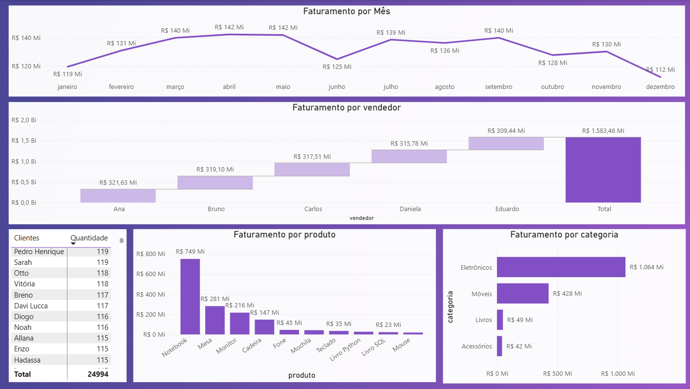

## 📊 E-commerce Data Pipeline: SQL, Python & Power BI
Este projeto apresenta um pipeline completo de análise de dados, desde a carga e tratamento de dados brutos até a criação de dashboards executivos para tomada de decisão. O foco foi analisar o desempenho de vendas de um e-commerce para identificar gargalos e oportunidades de crescimento.

## 📂 Estrutura do Projeto
A organização do repositório segue as melhores práticas de Engenharia de Dados:

dashboard/: Arquivo fonte do Power BI (.pbix).

data/: Camadas de dados.

raw/: Dados brutos originais (vendas_desafio.csv).

processed/: Dados limpos e agregados prontos para análise.

Docs/: Documentação de apoio, PDF do desafio e screenshots do dashboard.

python/: Jupyter Notebook com todo o processo de limpeza (Pandas) e visualização estatística (Matplotlib).

sql/: Scripts para criação do banco de dados e queries analíticas de performance.

## 🛠️ Tecnologias Utilizadas
Banco de Dados: PostgreSQL (DML e DDL).

Linguagem: Python 3.x.

Bibliotecas: Pandas, Matplotlib.

Dashboard: Power BI

## 💡 Insights de Negócio (Parte 3 do Desafio)
Após o processamento dos dados, as seguintes conclusões foram extraídas:

1. Qual categoria vende mais?
Categoria: A categoria de Eletrônicos detém o maior faturamento, impulsionada pelo ticket médio elevado de itens como Notebooks.

2. Produto: O Notebook é o item com maior peso financeiro, enquanto acessórios (Mouse/Teclado) lideram em volume de unidades.

3. Qual vendedor vende mais?
Vendedor Destaque: Identificamos que a vendedora Ana superou a meta mensal, sendo responsável pelo Faturamento Total de R$321,63 Mi

4. Sazonalidade: O mês de Abril apresentou um pico de vendas, sugerindo alta demanda por campanhas sazonais.

5. Comportamento do Cliente
Recorrência e Fidelidade: Sim, identificamos clientes recorrentes. O "Top 10 Clientes" possui mais de 119 compras por usuário, indicando uma base fiel que pode ser explorada com programas de recompensas.

## 📈 Visualização de Dados

### Contato:
* Emerson Nóbrega de Oliveira
* [Linkedin](https://www.linkedin.com/in/emersonnobrega/)
* [E-mail](emersonnobrega10@gmail.com)
